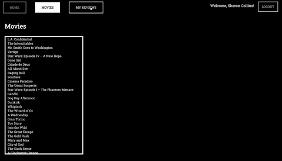
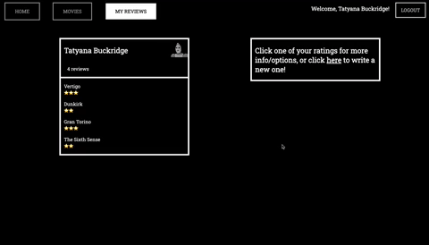

# Movie Mindset Review App

The Movie Mindset Review App is a single page React Application which works with a custom [Sinatra API backend](https://github.com/goose20090/phase-3-project-backend). It allows users to create personal accounts, see other accounts' reviews for particular movies and contribute their own. Changes made throughout the site will persist to the custom backend.

It was partly designed to fulfil a set of passing criteria for the phase 3 project of Flatiron's Software Engineering Course.

Exactly how this app fulfils those requrements can be found in the README of this [project's backend](https://github.com/goose20090/phase-3-project-backend). The README for this repository serves as a layout for the App's User experience.

## User Experience

### __Basic Navigation__
Client-side routes can be navigated via the nav bar:

On the 'Movies' page, users can explore a list of movies. Each can be clicked to lead to a nested route with content specific to that film via a list-detail interface:

Each rating can be clicked each Movie route, to provide info on each review it represents:

### __Login features__

Users can click the "Login" button to pick an account to login to:

Logging in provides a user with a custom page of their reviews. Again, each review can be clicked for more info and options:

Users can log out:

...and create their own accounts, that will persist across renders, with a sign up pop-in form:

### __Crud Actions__

In this app, there are 3 data sets: Users, Movies and Reviews. 

As shown above, with the signup form, the user can perform a create action for the 'Users' model, with the sign up pop-in form.

Users can click on reviews in their specific 'My Reviews' route, to update their contents:

Here, they can also delete their reviews:

On their page, users can use a search bar to find movies to create new reviews for:

From that search bar, they can create a new movie to be reviewable for all users:

## Notes

- The styling of buttons and NavLinks was taken from the ['Cool Buttons'](https://codepen.io/canvasplay/pen/WXWobd), codepen by canvasplay

- The star rater was built with the help of [this blog](https://dev.to/michaelburrows/create-a-custom-react-star-rating-component-5o6), by Michael Burrows

- This app uses the [Roboto Slab](https://fonts.google.com/specimen/Roboto+Slab) font

- Some of the customStyles in the LoginSelect function were achieved by giving prompts to [ChatGPT](https://chat.openai.com/chat)